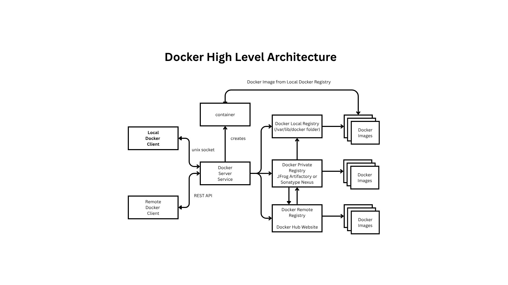
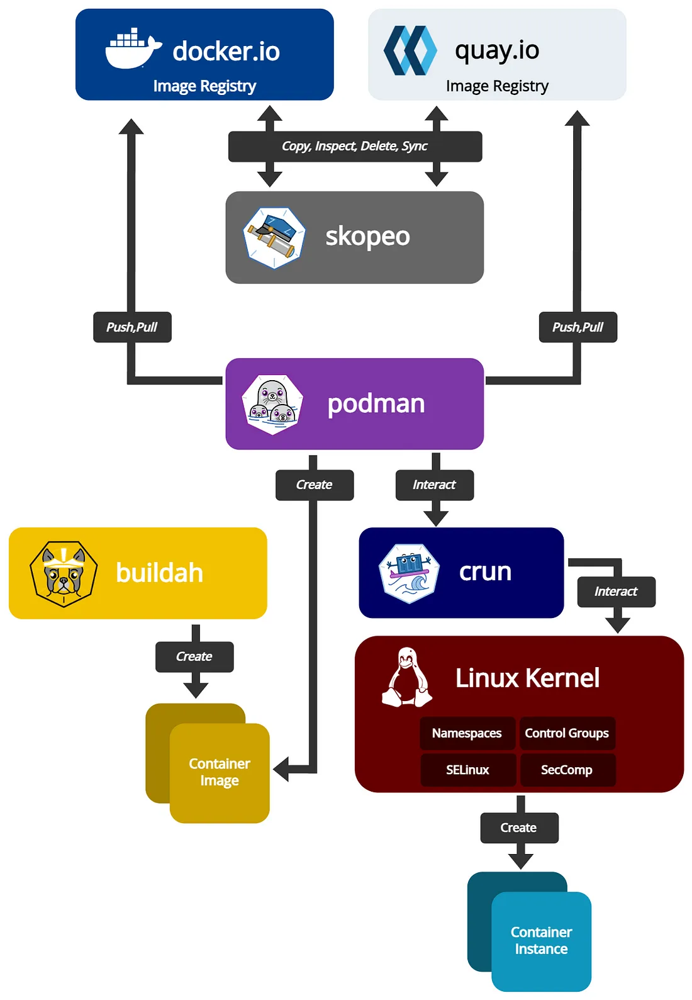

# Day 1

## Info - Installing Podman in Ubuntu
```
sudo apt update
sudo apt-get -y install podman
```

## Lab - Check if podman is installed in your lab machine
```
podman --version
podman images
```

## Info - Container Engine
<pre>
- it is a high-level software that manages container images and containers
- highly user-friendly, abstracts lots of complex internal implementation details nicely,while providing user-friendly commands
- internally Container Engines depends on Container Runtime
- examples
  - Docker
    - internally depends on containerd, which in turn depends on runC Container Runtime
  - Podman
    - internally depends on CRI-O Container Runtime
</pre>

## Info - Container Runtime
<pre>
- is a low-level software that manages container images and containers
- not so user-friendly, hence no end-users normally uses this directly
- examples
  - CRI-O Container Runtime
  - runC Container Runtime
</pre>

## Info - Container Images
<pre>
- Container Images are similar to Operating System ISO files we download from microsoft, ubuntu, etc.,
- technically it is possible to have more than one applicaiton per Container Image, but that is the best practice
- as per industry best practices, only one application per container is allowed
- is a blueprint of a running container
- all the necessary softwares can be installed while creating a image
- using container image, we can create containers
- every container image has an unique ID and name
- it is broken down into many image layers
- one container image may refer one or more image layers
- each image layer has an unique ID
- the image layers can be shared by container images
</pre>

## Info - Containers
<pre>
- is running instance of a Container Image
- one application along with it all its dependencies
- it is an application process that runs in its own namespace
- Linux kernels supports 2 features which enables the container technology
  - Namespace
    - is used to isolate one container from the other
  - Control Groups ( CGroups )
- it gets 
  - it own IP Address
  - it own Filesystem 
  - network namespace
    - network stack
    - software defined network card ( NIC )
  - its own port range ( 0 - 65535 )
</pre>

## Docker Overview
<pre>
- is developed in Golang by a company called Docker Inc
- it follows client-server Architecture
  - client tool (docker)
  - server tool (dockerd - which runs a service)
- docker images are stored in local registry folder /var/lib/docker
- if any one user has downloaded a particular image, it is stored in the /var/lib/docker folder
- when other users attempt to list the images, they will see all the images under /var/lib/docker
- the containers created by one user will be visible to other users in the same linux machine
</pre>

## Docker - High Level Architecture


## Podman - High Level Architecture


## Podman Overview
<pre>
- is an open source product 
- primarily maintained by Red Hat
- it creates root-less containers ( meaning no admin/root user created within container images )
- Red Hat acquired a company called CoreOS
- The organization CoreOS had 2 interesting products
  1. CoreOS - Operating System optimized & Secured for Container Orchestration Platforms like Kubernetes/Openshift
  2. Container Runtime called rkt(pronounced as rocket)
- Red Hat developed Podman Container Engine and CRI-O Container Runtime
- The ideas from rkt were in created CRI-O
- Starting from Red Hat Openshift 4.x, Openshift stopped support for Docker, they moved to Podman instead
- Podman stores container images for every user (isolated by users)
- Podman containers created by one user is not visible to other users (isolated by users)
</pre>

## Pod Overview
<pre>
- a logical group of many containers is called a Pod
- each container is a separate application process
- all the containers that belongs to a single Pod, they get the same IP address
- all the containers that belongs to a single Pod, they get to share the same Port Range ( 0 - 655535 )
</pre>

## Info - Podman Local Registry path
<pre>
/home/<your-linux-user>/.config/containers  
</pre>

## Lab - Creating a container in Podman
For downloading nginx image
```
podman pull docker.io/library/nginx:latest
```

To create and run a container
```
podman run -d --name nginx --hostname nginx docker.io/library/nginx:latest
```

To list the running containers
```
podman ps
```

## Lab - Podman image listing
Podman images is the default 
<pre>
podman images
</pre>

List podman images with just the image ids
```
podman image ls --quiet
```

List all images without the heading
```
podman images --noheading
```

List all images with full image id
```
podman image list --no-tunc
```

Finding more details about a container image
```
podman image inspect <name of the container image>
podman image inspect docker.io/library/nginx:latest
```

## Lab - Create a container
```
podman run registry.fedoraproject.org/fedora:latest echo hello
```

Listing the running containers, you are not supposed to see the 
```
podman ps
```

If you wish to see all containers even the ones which isn't running
```
podman ps -a
```

## Lab - Getting inside a running container shell
```
# Type this on your lab machine i.e ubuntu terminal
podman ps
podman exec -it nginx /bin/sh

# Type thes commands inside the container shell
ls
hostname
hostname -i

# To come out of the container shell
exit
```

## Lab - Finding the IP Address of a container
```
podman exec nginx hostname -i
```

## Lab - Deleting a running container
```
podman ps
podman stop nginx
podman rm nginx
```

## Lab - Port Forwarding
In the below command, port 8085 opens a up port in local machine, any request received at port 8085 will be forwared to the port 80 of nginx container.
```
podman run -d -p 8085:80 nginx
```

Troublesshooting bind issue
<pre>
- May be the 8085 port is already used by other participant
- Replace 8085 with some other non-conflicting port in the range 1024 to 65535 )
</pre>

Now you may access the web page hosted inside the nginx contianer
```
curl http://localhost:8085
```

## Lab - Deleting a docker image
```
# List images before deleting
podman images

#Delete the image from your local registry( deletes only for you )
podman rmi registry.fedoraproject.org/fedora:latest

# List images after deleting
podman images
```

## Lab - Manage Pods in Podman
The below command will a Pod with one hidden pause container
```
podman pod create nginx
```

Listing the pods
```
podman pod list
```

Listing the containers ( in case you wish to see the pause container created for the nginx pod )
```
podman ps -a
```

Let's add the nginx application container into the nginx pod
```
podman run -d --name nginx --pod nginx docker.io/nginx:latest
```

Let's list the containers
```
podman ps -a
```

Let's list the pods
```
podman pod list
```

Find more details about the pod
```
podman pod inspect nginx
```

Stopping a running Pod
```
podman pod list
podman pod stop nginx
podman pod list
```

Start an exited Pod
```
podman pod list
podman pod start nginx
podman pod list
```

Restart a running Pod
```
podman pod list
podman pod restart nginx
podman pod list
```

Deleting a pod gracefully
```
podman pod stop nginx
podman pod rm nginx
```

Deleting a Pod forcibly
```
podman pod rm -f nginx
```


## Lab - Creating a custom podman image
Create a folder
```
mkdir -f ~/custom-docker-image
cd ~/custom-docker-image
```

Create a file named Dockerfile 
```
FROM docker.io/nginx:alpine

COPY index.html /usr/share/nginx/html/index.html

EXPOSE 80
```

Let's build the custom image
```
podman build -t mynginx:1.0 .
```

Now you may create a pod with your custom podman image
```
podman pod create my-nginx
podman run -d --name my-nginx --pod my-nginx mynginx:1.0
podman pod list
podman pod inspect my-nginx
```

## Lab - Replace a container from a Pod
List the pods
```
podman pod list
```

List the containers
```
podman ps -a
```

Now let's delete the container
```
podman rm -f nginx 
```

Now if you list and see the pod containers count it will be minus 1
```
podman pod list
```

Now you may add a new container into the pod
```
podman run -d --name nginx --pod nginx docker.io/nginx:latest
podman ps -a
podman pod list
```

## Lab - Signing and Verifying container image (Incomplete - let's revisit)
Let's create a private registry locally
```
podman run -d -p 5000:5000 --name registry registry:2
```

Tag your custom container image
```
podman tag localhost/mynginx:1.0 localhost:5000/mynginx:1.0
```

Configure the registry by editing ~/.config/containers/registries.conf
```
[[registry]]
location = "localhost:5000"
insecure = true
```

Restart podman service
```
systemctl restart podman
systemctl status podman
```

Push your image to local registry after signing
```
podman push --sign-by tektutor localhost:5000/mynginx:1.0
```

Check if your custom image is available in private container registry
```
curl http://localhost:5000/v2/_catalog
```

Export the GPG Public key
```
gpg --armor --export tektutor > ~/tektutor-pubkey.gpg
```

Configure the trust policy ~/.config/containers/policy.json
<pre>
{
  "default": [
    {
      "type": "reject"
    }
  ],
  "transports": {
    "docker": {
      "localhost:5000/mynginx": [
        {
          "type": "signedBy",
          "keyType": "GPGKeys",
          "keyPath": "/home/jegan/tektutor-pubkey.gpg"
        }
      ]
    }
  }
}  
</pre>  

Delete your local image
```
podman rmi localhost:5000/mynginx:1.0
```

Try pulling the image from private container registry 
```
podman pull localhost:5000/mynginx:1.0
```


## Python Overview
<pre>
- is a scripting language
- it is one of the dynamically typed programming language
- this language is used pretty much everyone
  - academic
  - console based applications
  - web based - flask, Django Web Frameworks
  - to develop games
  - to develop cross-platform GUI applications for Desktops using Qt & QML
  - used in Machine/Deep Learning
</pre>

## Lab - Hello World Python script
hello.py
<pre>
  
</pre>
