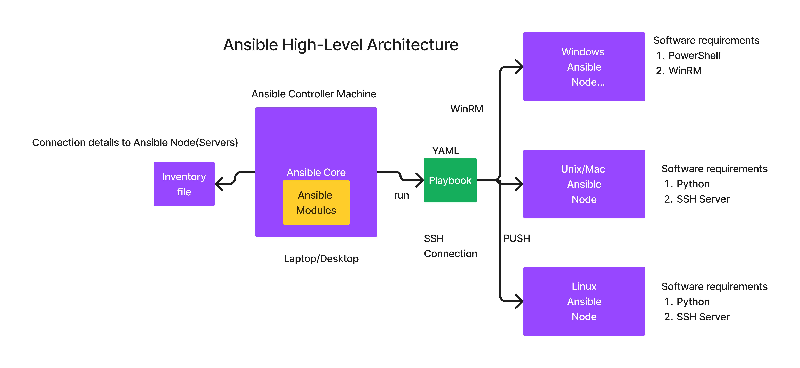

# Day 2

## Demo - Installing ansible core in Ubuntu
````
wget -O- "https://keyserver.ubuntu.com/pks/lookup?fingerprint=on&op=get&search=0x6125E2A8C77F2818FB7BD15B93C4A3FD7BB9C367" | sudo gpg --dearmour -o /usr/share/keyrings/ansible-archive-keyring.gpg

echo "deb [signed-by=/usr/share/keyrings/ansible-archive-keyring.gpg] http://ppa.launchpad.net/ansible/ansible/ubuntu $UBUNTU_CODENAME main" | sudo tee /etc/apt/sources.list.d/ansible.list

sudo apt update && sudo apt install ansible
````

## Info - Configuration Management Tools Overview
<pre>
- Configuration Management Tools helps us automate system administrative activities
- it is one of the DevOps tools
- With Configuration Management Tools
  - given a machine with some OS pre-installed
  - we can remotely using these tools to further install/uninstall,configure, update/upgrade softwares, manage users, manage networks etc on that machine 
- examples
  - Puppet ( oldest - developed and maintained by Perforce )
  - Chef
  - Salt/Saltstack
  - Ansible
</pre>

## Info - Ansible Overview
<pre>
- ansible is developed by Michael Deehan 
- Michael Deehan started a company called Ansible Inc
- ansible can only be installed in Linux distros, no Windows
- the machine where Ansible is installed is called Ansible Controller Machine(ACM)
- the machines/servers that ansible is going to manage are called Ansible Nodes
- Ansible Nodes
  - are containers or servers, could be physical server or virtual machine, or ec2 instances running in public cloud
  - it could be Server with Linux or Unix or Windows or Mac OS-X, Router, Switch, etc.,
  - Unix/Linux/Mac
    - required softwares
      1. SSH Server should be there
      2. Python should be there
  - Windows
    1. WinRM should be there
    2. Powershell should be supported
- ansible comes in 3 flavours
  1. Ansible Core - open source, CLI only
  2. AWX 
     - open source 
     - supports Webconsole GUI
     - developed on top of Ansible core
     - user management
     - supports many additional features on top of Ansible core
  3. Ansible Automation Platform 
    - formerly called Ansible Towers
    - developed on top of opensource AWX
    - all the features supported by AWX are supported in Ansible Tower or Ansible Automation Platform
    - you get support from Red Hat
- installing ansible is very easy
- Ansible Modules
  - are Python scripts in case the node happens to be an Unix/Linux/Mac OS
  - are Powershell scrips in case the node is a Windows machine
  - Ansible comes with many ansible modules
    - there is a module called copy to copy files from controller machine to node or vice versa
    - there is a windows called win_copy to copy files from controller machine to node or vice versa
    - file modules helps us create empty files, directories with specific permissions and owernship
    - apt module to install/uninstall/upgrade softwares in Debain(Ubuntu, Raspberry, Kali like OS )
    - yum module to install/uninstall/upgrade softwares in Red Hat Linux family (CentOS stream, Fedora, RHEL )
- Playbook (YAML File )
  - playbook invokes one or more ansible modules sequentially one after the other 
  - DSL is YAML
</pre>

## Info - Ansible High Level Architecture


## Lab - Clone this training repository
```
cd ~
git clone https://github.com/tektutor/advanced-ansible-july2025.git
cd advanced-ansible-july2025
```

## Lab - Building Custom Ubuntu Ansible Node container image
```
# Generate key-pair, accept all default by hitting enter whenever it prompts for something
cd ~
ssh-keygen

cd ~\advanced-ansible-july2025
git pull
cd Day2/custom-container-images/ubuntu
cat Dockerfile
cp ~/.ssh/id_ed25519.pub authorized_keys
podman build -t tektutor/ubuntu-ansible-node:1.0 .
podman images | grep ubuntu-ansible
```

Expected output


## Lab - Building Custom Rocky Ansible Node container image

```
cd ~\advanced-ansible-july2025
git pull
cd Day2/custom-container-images/rocky
cat Dockerfile
cp ~/.ssh/id_ed25519.pub authorized_keys
podman build -t tektutor/rocky-ansible-node:1.0 .
podman images | grep rocky-ansible
```

Expected output


## Lab - Creating ubuntu ansible node containers and testing it
Let's list the custom images
```
podman images
```

Let's create couple of ubuntu ansible node containers
```
podman run -d --name ubuntu1 --hostname ubuntu1 -p 2001:22 -p 8001:80 tektutor/ubuntu-ansible-node:1.0
podman run -d --name ubuntu2 --hostname ubuntu2 -p 2002:22 -p 8002:80 tektutor/ubuntu-ansible-node:1.0
```

List and check if ubuntu1 and ubuntu2 ansible node containers are running
```
podman ps
```

SSH into ubuntu1 and ubuntu2 containers and check if it is allowing you to login without prompting for password
```
ssh -p 2001 root@localhost
exit
ssh -p 2002 root@localhost
exit
```
Expected output


## Lab - Ansible ping ad-hoc command
```
cd ~/advanced-ansible-july2025
git pull
cd Day2/ansible
ansible -i inventory all -m ping
ansible -i inventory ubuntu1 -m setup
ansible -i inventory all -m shell -a "hostname -i"
```

## Lab - Writing a simple ansible playbook
```
cd ~/advanced-ansible-july2025
git pull
cd Day2/ansible/playbooks
ansible-playbook -i ../inventory ping-playbook.yml 
```


## Lab - Running the install nginx playbook

```
cd ~/advanced-ansible-july2025
git pull
cd Day2/ansible/playbooks
ansible-playbook -i ../inventory install-nginx-playbook.yml 
```

If all goes well, you may test it as shown
```
podman ps | grep tektutor
curl http://localhost:<your-container1-port>
curl http://localhost:<your-container2-port>
```

Expected output


## Lab - Conditional installation in ansible playbook
Let's create couple of rocky ansible node containers
```
# List our custom images
podman images | grep tektutor

# Create two rocky ansible node containers using our custom podman image
podman run -d --name rocky1 --hostname rocky1 -p 2003:22 -p 8003:80 tektutor/rocky-ansible-node:1.0
podman run -d --name rocky2 --hostname rocky2 -p 2004:22 -p 8004:80 tektutor/rocky-ansible-node:1.0

## List all the running containers
podman ps
```

Let's test if SSH works in rocky1 and rocky2
```
ssh -p 2003 root@localhost
exit
ssh -p 2004 root@localhost
exit
```


We need to add the rocky container details in our inventory, the updated inventory should look as shown below
<pre>
[all]
ubuntu1 ansible_port=2001
ubuntu2 ansible_port=2002
rocky1  ansible_port=2003
rocky2  ansible_port=2004

[all:vars]
ansible_user=root
ansible_host=localhost
ansible_private_key_file=~/.ssh/id_ed25519  
</pre>


Check if you are able to ping all nodes
```
ansible all -m ping
```


Now run the install-nginx-playbook.yml and observe the output
```
cat ansible.cfg
ansible-playbook install-nginx-playbook.yml
```


## Lab - Running the refactored playbook
```
cd ~/advanced-ansible-july2025
git pull
cd Day2/ansible/playbooks/refactored
ansible-playbook install-nginx-playbook.yml 
```


