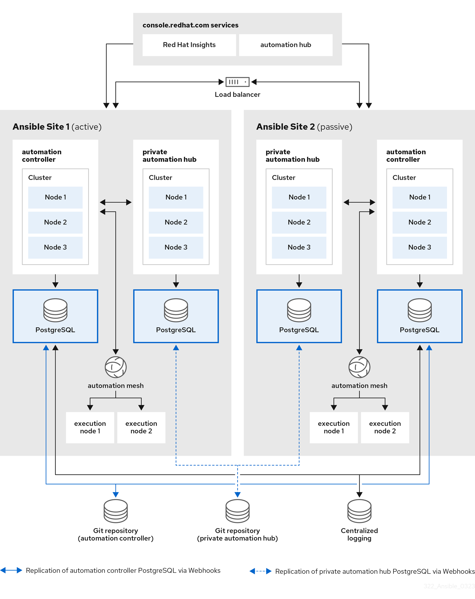

# Day 3

## Info - Ansible Automation Platform Overview
<pre>
- Red Hat’s enterprise solution for automating IT tasks across infrastructure, applications, networks, security, and cloud environments 
- built around Ansible, the popular open-source automation tool
- supports enterprise-grade features like:
  - A web UI (Automation Controller)
  - RBAC (Role-Based Access Control)
  - Logging & analytics
  - Execution environments
  - Certified content and collections
  - Integration with source control (Git), ticketing systems, and more    
</pre>

#### Automation Controller
<pre>
- Manages, schedules, and runs Ansible playbooks. UI + REST API (formerly AWX/Ansible Tower)   
</pre>

#### Execution Environments (EE)
<pre>
- Containerized environments where automation runs    
</pre>

#### Automation Hub
<pre>
- Internal or Red Hat-hosted repository of certified and custom content (collections, roles, plugins)   
</pre>

#### Automation Analytics
<pre>
- Dashboard that shows usage, trends, job status, and recommendations. Hosted by Red Hat    
</pre>

#### Automation Mesh
<pre>
- Connects distributed execution nodes across data centers, clouds, and edge   
</pre>

#### Ansible Content Collections
<pre>
- Modular bundles of roles, playbooks, plugins, and docs. Used inside playbooks.   
 </pre>

#### RBAC & Credentials
<pre>
- Secure control over who can do what and access which systems   
</pre>

## Info - Ansible Automation Platform - High Level Architecture


## Lab - Getting help about any ansible module
```
ansible-doc service
ansible-doc shell
ansible-doc apt
ansible-doc yum
ansible-doc template
ansible-doc file
ansible-doc command
```

## Lab - Finding total number of ansible modules supported by your ansible
```
ansible-doc -l | wc
```


## Lab - Finding the status of service
```
podman exec <your-container-name> service nginx status
ansible -i hosts -m shell -a "service nginx status"
```

## Lab - Creating a Project in Ansible Automation Platform (AAP)
GitHub url, use main branch
<pre>
https://github.com/tektutor/advanced-ansible-july2025.git
</pre>

Navigate to AAP Webconsole

Navigate to Automation Execution --> Projects

Select "Create Project"


## Lab - Creating Credentials in Ansible Automation Platform (AAP)
Navigate to Automation Execution --> Infrastructure --> Credentials

Click "Create Credential"

Open a terminal
```
ls -l ~/.ssh/
cat ~/.ssh/id_ed25519
```

## Lab - Creating all 4 hosts in AAP


## Demo - Install OpenLDAP in Ubuntu (Just for your reference, please don't attempt this in our lab environment )
```
sudo apt update
sudo apt install slapd ldap-utils -y
```


Configuring LDAP Server
<pre>
sudo dpkg-reconfigure slapd  
</pre>

How to respond when the above commands prompts your response
<pre>
Omit OpenLDAP server configuration?	No
DNS domain name?	palmeto.org
Organization name?	Palmeto
Administrator password?	palmeto@123
Database backend?	MDB
Remove database when slapd is purged?	No
Move old database?	Yes
</pre>

Check if LDAP Server is running
```
sudo systemctl status slapd
sudo ss -tulnp | grep :389
```

Check if LDAP search works
```
ldapsearch -x -LLL -H ldap://localhost -b dc=palmeto,dc=org
```

Create a file named base.ldif
<pre>
dn: ou=users,dc=palmeto,dc=org
objectClass: organizationalUnit
ou: users

dn: ou=groups,dc=palmeto,dc=org
objectClass: organizationalUnit
ou: groups  
</pre>

Apply the above configuration
```
ldapadd -x -D "cn=admin,dc=palmeto,dc=org" -W -f base.ldif
```

Add LDAP users, creat a file named users.ldif
<pre>
dn: uid=jegan,ou=users,dc=palmeto,dc=org
objectClass: inetOrgPerson
uid: jegan
sn: Swaminathan
cn: Jeganathan Swaminathan
mail: jegan@tektutor.org
userPassword: palmeto@123

dn: cn=admins,ou=groups,dc=palmeto,dc=org
objectClass: groupOfNames
cn: admins
member: uid=jegan,ou=users,dc=palemto,dc=org  
</pre>

Create the user
```
ldapadd -x -D "cn=admin,dc=palmeto,dc=org" -W -f users.ldif
```

Search users
```
ldapsearch -x -LLL -b "ou=users,dc=palmeto,dc=org"
```

Search groups
```
ldapsearch -x -LLL -b "ou=groups,dc=palmeto,dc=org"
```

Configure Ubuntu firewall to allow LDAP
```
sudo ufw allow 389
```

LDAP Server details
<pre>
Base DN : dc=palmeto,dc=org
Admin DN: cn=admin,dc=palmeto,dc=org
User DN	: uid=jegan,ou=users,dc=palmeto,dc=org
Group DN: cn=admins,ou=groups,dc=palmeto,dc=org
Password: palmeto@123
</pre>

Script to extract existing linux users and add them as users in LDAP server
```
#!/bin/bash

# Hashed value of "palmeto@123" using slappasswd
LDAP_PASS="{SSHA}Xky2OjkOZt5U4eebv9rWsk9VUYR6Fa9Z"

# Output LDIF file
OUTPUT_FILE="palmeto-ldap-users.ldif"
> "$OUTPUT_FILE"

for user in $(ls -l /home | awk '{print $3}' | sort -u); do
    # Get user details from /etc/passwd
    IFS=':' read -r username _ uid gid full home shell <<< "$(getent passwd "$user")"

    # Skip if user not found
    [ -z "$username" ] && continue

    # Set default values for cn and sn
    if [ -z "$full" ]; then
        cn="$username"
        sn="user"
    else
        cn=$(echo "$full" | cut -d' ' -f1)
        sn=$(echo "$full" | cut -d' ' -f2)
        [ -z "$cn" ] && cn="$username"
        [ -z "$sn" ] && sn="user"
    fi

    # Set email from username
    email="${username}@palmeto.org"

    cat <<EOF >> "$OUTPUT_FILE"
dn: uid=$username,ou=users,dc=palmeto,dc=org
objectClass: inetOrgPerson
objectClass: posixAccount
objectClass: shadowAccount
cn: $cn
sn: $sn
uid: $username
uidNumber: $uid
gidNumber: $gid
homeDirectory: $home
loginShell: $shell
mail: $email
userPassword: $LDAP_PASS

EOF
done

echo "LDIF file generated: $OUTPUT_FILE"
```

In case you wish to delete existing users from LDAP server before adding the below users
```
ldapsearch -LLL -x -D "cn=admin,dc=palmeto,dc=org" -w 'palmeto@123' -b "ou=users,dc=palmeto,dc=org" "(objectClass=inetOrgPerson)" dn \
  | grep '^dn:' \
  | sed 's/^dn: //' \
  | xargs -n1 ldapdelete -x -D "cn=admin,dc=palmeto,dc=org" -w 'palmeto@123'
```

Let's add the ldap users now
```
ldapadd -x -D "cn=admin,dc=palmeto,dc=org" -W -f palmeto-ldap-users.ldif
```

Let's create an openshift secret
```
oc create secret generic ldap-secret \
  --from-literal=bind_dn='cn=admin,dc=palmeto,dc=org' \
  --from-literal=bind_password='palmeto@123' \
  -n aap
```

Login in to Ansible Automation Platform Admin UI
Settings --> Authentication --> LDAP --> Add LDAP Source

Paste the below LDAP configuration
<pre>
LDAP Server URI: ldap://ldap.palmeto.org
StartTLS: false
Bind DN: cn=admin,dc=palmeto,dc=org
Bind Password: palmeto@123
User Search Base: ou=People,dc=palmeto,dc=org
User Search Filter: (uid=%(user)s)
Group Search Base: ou=Groups,dc=palmeto,dc=org
Group Object Class: groupOfNames
Group Type: MemberDNGroupType
Group Member Attribute: member
Require Group: <optional LDAP group DN>
User DN Template: uid=%(user)s,ou=People,dc=palmeto,dc=org    
</pre>

Test Login
```
oc logs deployment/automationcontroller -n aap
```
